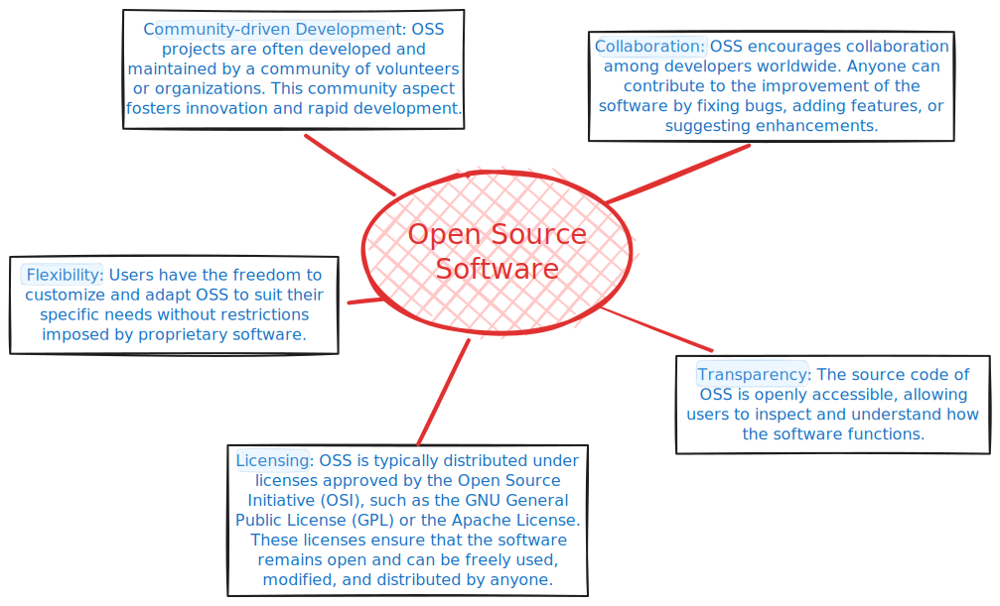
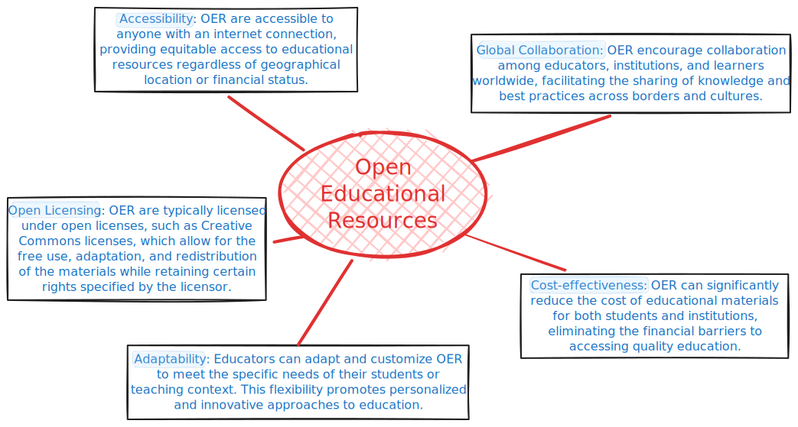
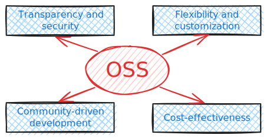

```{r, include=FALSE}
knitr::opts_chunk$set(echo = FALSE,
                      warning = FALSE,
                      tidy = FALSE,
                      message = FALSE,
                      fig.align = 'center',
                      out.width = "100%")
options(knitr.table.format = "html") 
```

```{r, include=FALSE}
knitr::write_bib(c('posterdown', 'rmarkdown','pagedown'), 'packages.bib')
```

# Open Source Software

Open Source Software (OSS) refers to software whose source code is freely available to users. This means that anyone can view, modify, and distribute the code as per the terms of the respective license.

{width="1500"}

<BR>

# Open Educational Resources

Open Educational Resources (OER) refer to educational materials that are freely accessible, openly licensed, and available for use, reuse, modification, and sharing.

{width="1500"}

<BR>
<BR>
<BR>

# Benefits of OSS

{width="1400"}


# Benefits of OER

{width="1400"}


```{r, out.width="120px", echo=FALSE}
library(qrcode)
code <- qr_code('http://tu-freiberg.de')
plot(code, col = c("white", "#00477e"))
```

# Toolchain Examples

Gold-Standard zu OER-Materialien: <https://open-educational-resources.de/tag/gold-standard/>