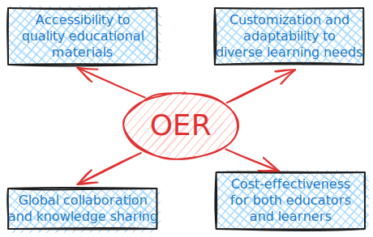

```{r, include=FALSE}
knitr::opts_chunk$set(echo = FALSE,
                      warning = FALSE,
                      tidy = FALSE,
                      message = FALSE,
                      fig.align = 'center',
                      out.width = "100%")
options(knitr.table.format = "html") 
```

```{r, include=FALSE}
knitr::write_bib(c('posterdown', 'rmarkdown','pagedown'), 'packages.bib')
```

# Open Source Software

Open Source Software (OSS) refers to software whose source code is freely available to users. This means that anyone can view, modify, and distribute the code as per the terms of the respective license.

```{r, echo=FALSE, out.width="1000px"}
knitr::include_graphics("OSS-Characteristics.excalidraw.svg")
```

 
<BR>

# Open Educational Resources

Open Educational Resources (OER) refer to educational materials that are freely accessible, openly licensed, and available for use, reuse, modification, and sharing.

```{r, echo=FALSE, out.width="1000px"}

```


<BR> <BR>

# Benefits of OSS and OER

:::: columns
::: {.column width="50%"}
```{r, echo=FALSE, out.width="600px"}

```

:::

::: {.column width="50%"}
```{r, echo=FALSE, out.width="600px"}

```

:::
::::

# Recent Developments

## Quarto

::: {.columns}

::: {.column width="80%"}
`Quarto` is an open-source scientific publishing system.

:::

::: {.column width="20%"}
```{r, out.width="300px", echo=FALSE}
library(qrcode)
code <- qr_code('https://quarto.org')
plot(code, col = c("white", "#00477e"))
```
:::
* Author using Jupyter notebooks or with plain text markdown in your favorite editor.
* Create dynamic content with Python, R, Julia, and Observable.
* Publish reproducible, production quality articles, presentations, dashboards, websites, blogs, and books in HTML, PDF, MS Word, ePub, and more.

:::


## Myst

::: {.columns}

::: {.column width="80%"}
`MyST` is an ecosystem of open-source, community-driven tools designed to revolutionize scientific communication. 

:::

::: {.column width="20%"}
```{r, out.width="300px", echo=FALSE}
library(qrcode)
code <- qr_code('https://mystmd.org')
plot(code, col = c("white", "#00477e"))
```
:::
*MyST*'s powerful authoring framework supports blogs, <BR>online books, scientific papers, reports and journals articles.
:::

## Reactive Notebooks

:::: {.columns}

::: {.column width="40%"}
`marimo` is an open-source *reactive notebook* for `Python` — reproducible, git-friendly, executable as a script, and shareable as an app.

```{r, out.width="300px", echo=FALSE}
library(qrcode)
code <- qr_code('https://marimo.io/')
plot(code, col = c("white", "#00477e"))
```

:::

::: {.column width="10%"}
<BR>
:::

::: {.column width="50%"}
When you change a variable, `Pluto.jl` automatically re-runs the `Julia` cells that refer to it. Cells can even be placed in arbitrary order - intelligent syntax analysis figures out the dependencies between them and takes care of execution.

```{r, out.width="300px", echo=FALSE}
library(qrcode)
code <- qr_code('https://github.com/fonsp/Pluto.jl')
plot(code, col = c("white", "#00477e"))
```


:::
  <BR>
::::

## Collection of Awesome OSS and OER
